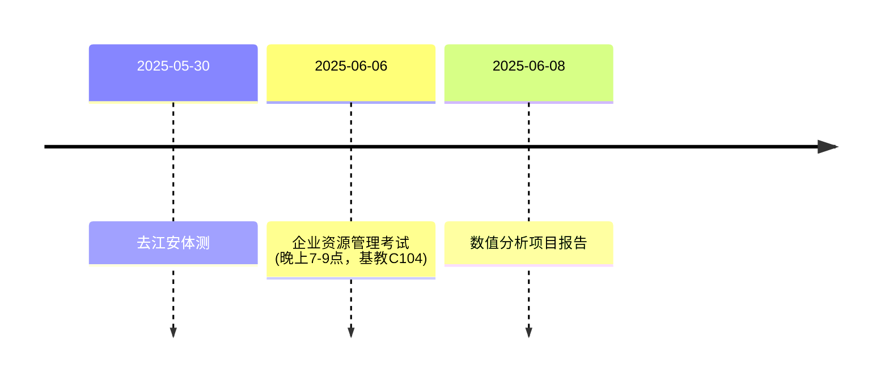

+++
date = '2025-05-27T15:08:36+08:00'
draft = false
title = '代码随想录_day10'
image = "img/code.jpg"
license = false
categories = [
  "代码随想录",
  "c++"
]
+++


## 1_用栈实现队列_leetcode_232

你说的“out栈前面加入了元素，实际上in后面加入了元素，不用着急马上加入到out栈，等out栈元素空了再一起加入，这样可以保证先进先出”这个描述非常准确地概括了核心优化逻辑。
没错，关键就在于：

push 操作只管往 stack_in 里塞。 这代表着新来的元素，它们暂时不用关心出队顺序。

pop 或 peek 操作的延迟倒腾： 只有当 stack_out 已经空了，无法再提供队头元素时，我们才一次性地把 stack_in 中的所有元素“倒”到 stack_out。

这个“倒腾”过程非常巧妙：由于栈是后进先出，stack_in 中最底部的元素（最早进入的）在倒腾后会变成 stack_out 的顶部元素（最先出队的）。

一旦 stack_out 有了元素，后续的 pop 和 peek 都会优先从 stack_out 获取，直到 stack_out 再次为空。

为什么这样做是高效的？

因为它避免了每次 push 或 pop 都进行倒腾操作。每个元素只会经历一次从 stack_in 到 stack_out 的移动，这使得整个序列操作的平均时间复杂度达到了 O(1)。

虽然单次倒腾可能需要 O(N) 的时间（N 是 stack_in 的元素数量），但由于每个元素只移动一次，所以分摊下来，每次操作的成本是很低的。

```cpp
#include <stack>
using namespace std;

class MyQueue {
private:
    stack<int> stack_in;
    stack<int> stack_out;
    void transfer_elements_if_needed() {
        if (stack_out.empty()) {
            while (!stack_in.empty()) {
                stack_out.push(stack_in.top());
                stack_in.pop();
            }
        }
    }

public:
    // 构造函数
    MyQueue() {}

    // 用栈实现队列
    // 1.元素push进入stack_in
    void push(int x) { stack_in.push(x); }

    // 弹出元素, 每次弹出的时候, stack_in要清空
    // 1.如果stack_out为空, 将stack_in元素全部弹出,加入到stack_out
    // 2.stack_out非空的情况下, 弹出
    int pop() {
        transfer_elements_if_needed();
        int result = stack_out.top();
        stack_out.pop();
        return result;
    }

    // 确保stack_out有元素可以看, 返回队列开头的元素,
    int peek() {
        transfer_elements_if_needed();
        return stack_out.top();
    }
    // stack_in 和 stack_out同时为空时, 返回为true
    bool empty() { return stack_in.empty() && stack_out.empty(); }
};
```

## 2_用队列实现栈_leetcode_225

```cpp
#include <queue>
using namespace std;

class MyStack {
queue<int> queue_stack;
public:
    MyStack() {
    }
    
    void push(int x) {
        queue_stack.push(x);
    }
    // 弹出栈的元素, 用queue实现
    // 1.弹出queue的size-1个元素, 再push进去
    // 2.弹出元素
    int pop() {
        int size = queue_stack.size();
        size--;
        while(size--){
            int temp = queue_stack.front();
            queue_stack.pop();
            queue_stack.push(temp);
        }
        int res = queue_stack.front();
        queue_stack.pop();
        return res;
    }
    
    int top() {
        return queue_stack.back();
    }
    
    bool empty() {
        return queue_stack.empty();
    }
};

/**
 * Your MyStack object will be instantiated and called as such:
 * MyStack* obj = new MyStack();
 * obj->push(x);
 * int param_2 = obj->pop();
 * int param_3 = obj->top();
 * bool param_4 = obj->empty();
 */
```

## 3_有效的括号_leetcode_20

```cpp
#include <stack>
#include <string>
using namespace std;

class Solution {
public:
    bool isValid_v2(string s) {
        stack<char> stack_char;

        // 1.剪枝
        if (s.size() % 2 != 0) {
            return false;
        }
        for (int i = 0; i < s.size(); i++) {
            if (s[i] == '(') {
                stack_char.push(')');
            } else if (s[i] == '{') {
                stack_char.push('}');
            } else if (s[i] == '[') {
                stack_char.push(']');
            }
            // 处理右括号
            else {
                // 栈为空
                if (stack_char.empty()) {
                    return false;
                }
                // 栈非空
                else if (s[i] == stack_char.top()) {
                    stack_char.pop();
                } else if (s[i] != stack_char.top()) {
                    return false;
                }
            }
        }
        // 循环结束后, 如果栈非空, 返回false
        return stack_char.empty();
    }
    bool isValid(string s) {
        stack<char> stack_char;

        // 1.剪枝
        if (s.size() % 2 != 0) {
            return false;
        }
        for (int i = 0; i < s.size(); i++) {
            if (s[i] == '(') {
                stack_char.push(')');
            } else if (s[i] == '{') {
                stack_char.push('}');
            } else if (s[i] == '[') {
                stack_char.push(']');
            }

            // 右括号, 情况1 栈顶的符号相同
            else if (!stack_char.empty() && s[i] == stack_char.top()) {
                stack_char.pop();
            }
            // 右括号, 情况2 栈顶的符号不相同
            else if (!stack_char.empty() && s[i] != stack_char.top()) {
                return false;
            }
            // 栈为空
            else if (stack_char.empty()) {
                return false;
            }
        }
        // 循环结束后, 如果栈非空, 返回false
        return stack_char.empty();
    }
};
```

## 4_删除字符串中的所有相邻重复项_leetcode_1047

```cpp
#include <algorithm>
#include <stack>
#include <string>
using namespace std;
class Solution {
public:
    string removeDuplicates_v2(string s) {
        // 利用字符串作为栈
        string stack_char;

        // 通过字符栈可以达到删除的目的, 关键是如何顺序输出
        for (int i = 0; i < s.size(); i++) {
            // 字符栈为空
            if (stack_char.empty()) {
                stack_char.push_back(s[i]);
            }
            // 字符栈非空
            else {
                if (s[i] != stack_char.back()) {
                    stack_char.push_back(s[i]);
                } else {
                    stack_char.pop_back();
                }
            }
        }
        return stack_char;
        
    }

    string removeDuplicates_v1(string s) {
        stack<char> stack_char;

        // 通过字符栈可以达到删除的目的, 关键是如何顺序输出
        for (int i = 0; i < s.size(); i++) {
            // 字符栈为空
            if (stack_char.empty()) {
                stack_char.push(s[i]);
            }
            // 字符栈非空
            else {
                if (s[i] != stack_char.top()) {
                    stack_char.push(s[i]);
                } else {
                    stack_char.pop();
                }
            }
        }
        string result = "";
        while (!stack_char.empty()) {
            result += stack_char.top();
            stack_char.pop();
        }
        reverse(result.begin(), result.end());
        return result;
    }
};
```
